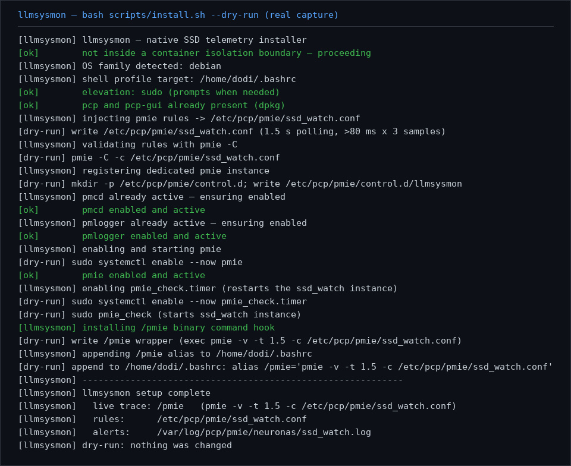
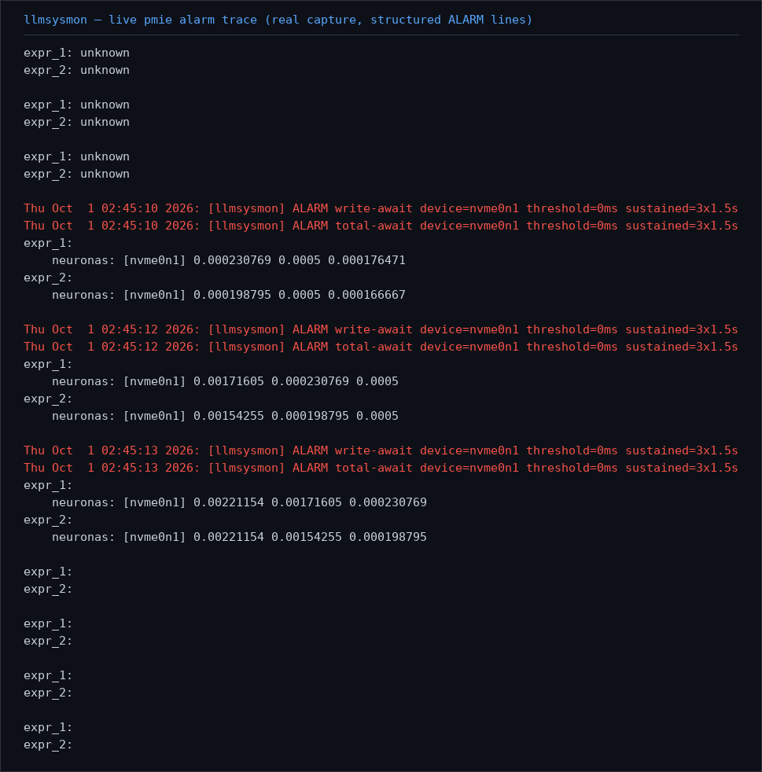
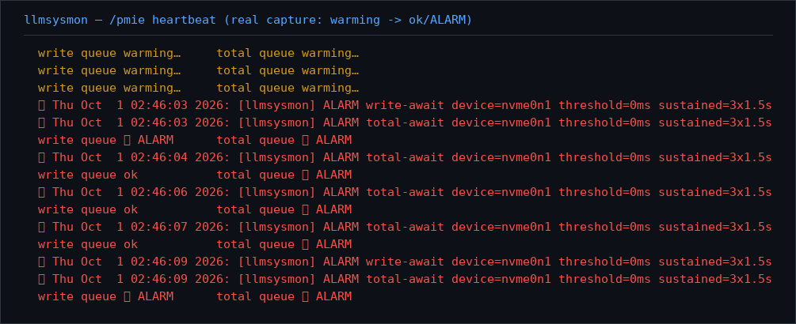

# llmsysmon

[](https://skills.sh/doditz/llmsysmon)

**Your SSD's health-checker that never sleeps.**

It watches how fast your SSD answers write requests — every 1.5 seconds, all day — and
tells you (and your AI agents) the moment your drive starts to struggle.

> Previously known as: llmpmcie (both names are searchable; llmsysmon is canonical).

**In any agent app (Claude Code, Cursor, Copilot, this kind of assistant): just type
`/llmsysmon`.** The skill checks your SSDs, renders a clean human report, and arms the
24/7 watchdog if it isn't running yet — the same experience in every compatible agent,
no shell knowledge needed. The terminal tools below (`/pmie` and friends) are optional
shortcuts for when you're already in a shell.

## The problem, in plain words

SSDs usually fail *slowly first*: tiny, repeated stutters before the real trouble.
A single stutter means nothing. But when write latency stays high for a while, your
drive is quietly telling you "I'm overwhelmed" — that's the moment you want to know.

**llmsysmon's promise:** if a disk's write queue stays above **80 ms for 3 checks in a
row** (that's ~4.5 seconds of sustained pain), it raises the alarm.

> *How much is 80 ms? A blink of an eye is about 100–150 ms. Your SSD should
> normally answer in under 10 ms — 80 ms means something is really off.*

## Install (2 commands, ~1 minute)

```bash
npx skills add doditz/llmsysmon   # step 1: download the skill (like getting an app)
bash scripts/install.sh           # step 2: set it up (like the app's installer)
```

Step 2 will ask for your password (`sudo`) — that's normal: it installs the
open-source PCP monitoring toolkit and registers a small watchdog. It prints every
single thing it does, in green ✓, so you're never wondering what's happening:



Prefer to look before you leap? `bash scripts/install.sh --dry-run` shows the whole
plan without changing anything. Scared of commands? You can also install by hand:

```bash
git clone https://github.com/doditz/llmsysmon.git
bash llmsysmon/scripts/install.sh
```

## Using it — this is the fun part

Open a terminal and type:

```bash
/pmie
```

*Two different slashes, two different things — worth knowing:*
- **In an agent app** (Claude Code, Cursor, this kind of assistant), `/llmsysmon` is how
  you *invoke the skill* — the leading slash is the universal "run this skill" convention.
- **On your machine**, `/pmie` is a real little program the installer places at the top of
  your file system — its address starts at `/`, which is why the slash is part of its name.
  Type it in any terminal and it runs.*

You'll see a live heartbeat of your drives, refreshing every 1.5 seconds. When a
drive crosses the line, the alarm fires and you see exactly which device and why:



Alarms are also written to the system log and to
`/var/log/pcp/pmie/<your-computer-name>/ssd_watch.log`, so they're never lost.

## Live dashboards

The same heartbeat comes in three flavors. You choose which one to open — nothing
pops up automatically.

- `/pmie` — the default, in-terminal heartbeat. Best for quick checks inside the
  terminal you're already using.
- `/pmie --detach` — opens the heartbeat in a small dedicated terminal window,
  so your main terminal stays free.

  
- `/pmie --detach-gui` — opens a graph window with line charts for write await
  and total await per disk. It follows your desktop dark/light theme and prefers
  the discrete GPU (`DRI_PRIME=1`) for smooth rendering. Requires `pcp-gui`,
  which the installer already installs.

## What just happened on my machine? (no jargon)

| The installer did… | …which means, in plain words |
|---|---|
| Installed `pcp` | The open-source Performance Co-Pilot toolkit — the sensor network this skill rides on |
| Started 3 services (`pmcd`, `pmlogger`, `pmie`) | The sensors, the recorder, and the watchdog — all set to start with your computer |
| Wrote the 80 ms rule to `/etc/pcp/pmie/ssd_watch.conf` | The watchdog's rulebook, in one file you can open and read |
| Created the `/pmie` command | A tiny door to the live view, available in any terminal |
| Added a `/pmie` shortcut to your shell profile | So the door stays open even after you close the terminal |

Nothing phones home. Nothing runs in the cloud. It's all local, open-source, and
reversible (uninstall = remove the same files it created).

## For the curious — how does it actually know?

PCP's sensors expose two numbers per disk, updated constantly:
how many write operations are *in flight*, and how many have *completed*.
Divide one by the other and you get the average wait — the exact same math your
local supermarket uses: *if 2 people are in the queue and the cashier serves 1 per
second, you'll wait 2 seconds.* llmsysmon checks that number every 1.5 s and only
shouts when it's been bad 3 times running — so one hiccup won't wake you up.

## Troubleshooting — human translation

| You see… | It actually means | What to do |
|---|---|---|
| `Container boundary detected… skipping` | You're inside a container/Docker — the watchdog belongs on the real machine | Run the installer on the host instead. Nothing is broken |
| `systemd not available…` | Your system doesn't run systemd (rare on desktops/servers) | llmsysmon needs systemd; this message stops you *before* anything is half-installed |
| `unsupported OS…` | You're on a distro outside the supported family | Supported: Debian/Ubuntu and RHEL/Fedora/CentOS/AlmaLinux/Rocky |
| `pmie rejected /etc/pcp/pmie/ssd_watch.conf` | The rule file got edited by hand or corrupted | Re-run `bash scripts/install.sh` — it rewrites a known-good config |
| `sudo: a password is required` | The installer needs admin rights for system files | Type your password when asked — it's how Linux protects itself (and you) |
| Alarm fires constantly | Your drive really is that busy — or the threshold is too strict for your workload | It's tunable: edit the `80 msec` value in the rule file, then re-run the installer |

## For agents & developers (the power section)

- **Machine-readable everything:** `bash scripts/install.sh --json --dry-run` emits
  NDJSON lifecycle events — pipe it, parse it, trust it.
- **MCP tool server** (zero dependencies): wire `scripts/llmsysmon-mcp.py` into any
  MCP client — it exposes `llmsysmon_status`, `llmsysmon_latency`,
  `llmsysmon_alerts`, `llmsysmon_install_dry_run`.

  ```json
  { "mcpServers": { "llmsysmon": {
      "command": "python3",
      "args": ["/path/to/llmsysmon/scripts/llmsysmon-mcp.py"] } } }
  ```

- **ACP headless agent:** other agents can talk to llmsysmon directly —

  ```bash
  acpx --agent "python3 /path/to/llmsysmon/scripts/llmsysmon-acp.py" exec \
       "what is the current SSD write latency?"
  ```

- **Self-tests built in:** `bash scripts/install.sh --self-test` — the installer's
  own unit tests, no system changes.
- The skill manifest for workspace agents lives in [SKILL.md](SKILL.md).

## Requirements

- Linux with systemd and sudo — Debian/Ubuntu or RHEL/Fedora/CentOS/AlmaLinux/Rocky
- A real machine (not a container) — the installer tells you kindly if it disagrees
